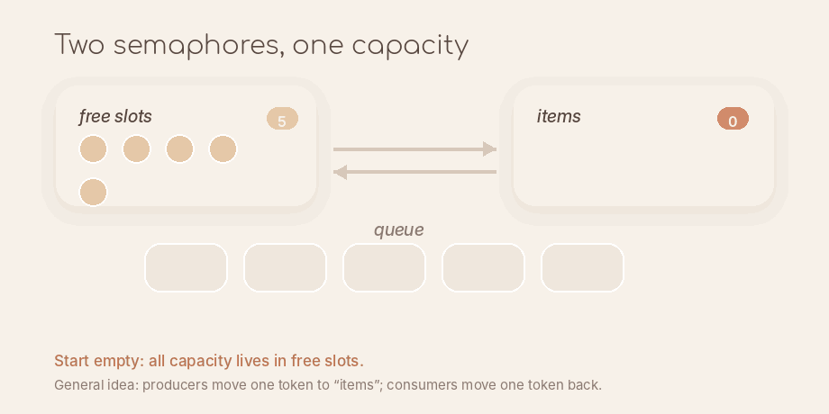

# mutex ( section locking )

for manual locking and unlocking of critical sections

Usage would almost always be a `unique_lock`

```cpp
{
    uniq lock

    locked section
}

other stuff
```

# semaphore ( a composite )

A wrapper around a mutex, a counter and a condition variable.

The core api makes sense when viewed as a bounded blocking queue though the naming is
not great ( though probably makes sense from an agnostic perspective ).

Another ( perhaps better) model is to think of slots as "permits", you can add a permit for free
but need to wait when you try to take one and there are none.

```cpp
#include<semaphore>

// N = max limit for sema, n = initially filled slots
std::counting_semaphore<N> sema(n);
```

- `acquire`: relate to taking, this is for consumers. Wait till some item exists ( aka count > 0 ) and notify
- `release(optional count)`: relate to releasing into the queue. increment counter and notify ( non blocking )

Note that while it would've been convenient if the sema used `N` as the queue bound size and waited if we are at
limit but what it does instead is UB if you release when sema is already at limit.

This is why making a bounded blocking queue with semas need two semas.

Imagine as one semaphore accounting for free slots and another accouting for the slots that have items.
You move "slots" to either free or taken.



# cv

Wait on a lock so you need a lock. This is for signalling purposes
where you want => wait till cond holds

- `cv.wait(lk)` where you check the condition but that is error-prone
- `cv.wait(lk, cond)` ALWAYS prefer this; read as "continue when condition holds ( and signalled )"
  - internally this is just `while(!cond) cv.wait(lk)`
  - this above is not a spin lock, cv has a lot of CLEVER logic within ( TODO )

by far very easy to get wrong. some idioms

- Always check condition first before waiting ( use the lambda as condition to avoid wait )
- Notify after unlocking and modifying ALL the state you need to modify

Something like this is almost always correct.

```cpp
{
    lock
    cv.wait(lock, cond)

    do stuff
}

cv.notify
```

How to name cvs?

- Do not use by role as in reader_cv or producer_cv
- Use by condition being waited for in the cv

# rwlock

uses `std::shared_mutex` and `std::shared_lock` for reads and `std::unique_lock` for writes

multiple readers allowed, single writer only

for read heavy workloads

# latch

a one time barrier

# barrier

- reusable
- expects N arrivals per "phase" ( which is reset and hence the reusable part )

```cpp
std::barrier b(3); // 3 arrivals
barrive_and_wait(); // mark this arrival and wait for others

// LESSER USED
arrive() // only mark arrival
wait() // only wait, used when ^ is used, kind of go in pair

arrive_and_drop() // mark arrival and permanently decrease the init arrival
// count that was set
```

# future and promise

move only.
for returning values from threads

# call once

for singleton initialization

# async (future helper)

create fut and threads easily. fire and forget

# packaged task (future helper)

created task wrapper but execution is manual (unlike async)

# shared future

10 threads waiting on a single future value ( like config load )
copyable future

# spin lock

I had this incorrect idea that a spinlock is just a volatile variable ( volatile so that
the compiler does not optimise away the read ) and then just a while loop. That is just
an incorrect implementation.

```
Thread A                 Thread B

lock()
  acquire lock

                         lock()
                           locked...
                           locked...
                           locked...
                           locked...

unlock()
                         acquire lock
```

The only difference over a mutex lock is just that thread B here keeps on checking and
consuming CPU cycles instead of going to sleep.

## `std::atomic_flag` as the simplest atomic primitive

The whole concept atomics is that the internals are IMPLEMENTED by the cpu ( so ARCH dependent
as well ) and GUARANTEED to be run atomically AS A WHOLE, this is why it has some weird operations
like `test_and_set`.

```cpp
std::atomic_flag flag = ATOMIC_FLAG_INIT;

// read
bool x = flag.test();

// write 0
flag.clear();

// write 1
bool old_flag = flag.test_and_set();
```

so a spinlock then becomes a a while loop like

```cpp
while (flag.test_and_set()) {
    // critical section
}
```

this is now guaranteed by cpu level atomic synchronisation

### But what hapens at the hardware level?

For making it easier, I'll assume the two threads execute with two different cores.
And entirely skip core-virtualisation. For say the same core cache, all this cache coherence is
less relevant but you still need synchronisation that atomics give you.

Rest is in separate [atomics on hardware](<Atomics on hardware.md>) note.
